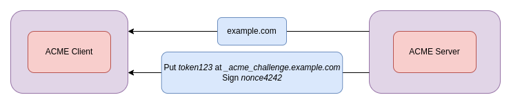
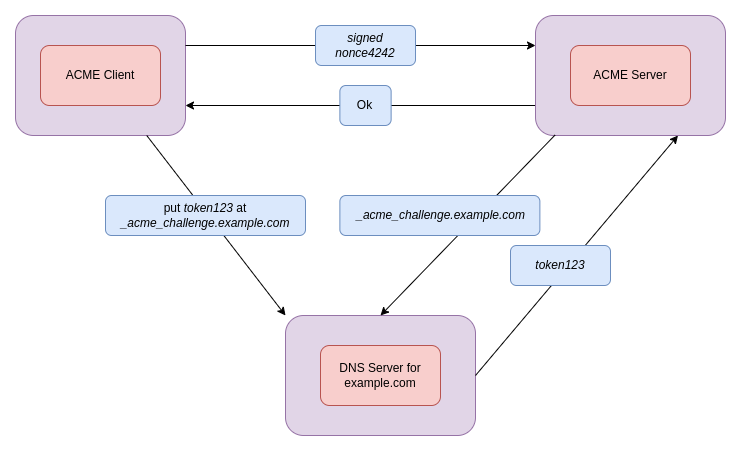
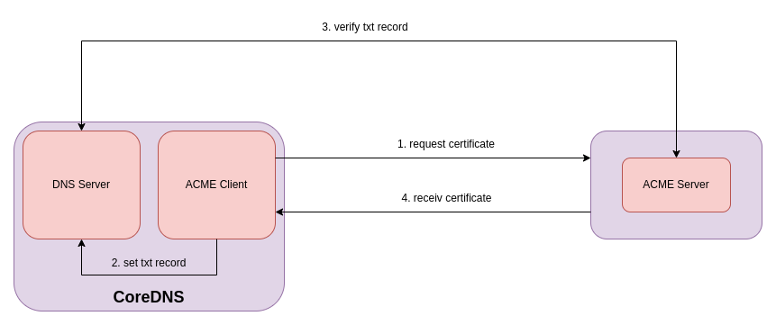

# tlsplus

## Name

*tlsplus* - generate and manage TLS certificates for you.

## Description

*tlsplus* is an alternative to the existing TLS plugin for CoreDNS, it can be used as a drop in replacement for the exisiting plugin and everything will continue to work.
What this plugin offers over the current builtin TLS plugin is the ability to generate and manage TLS certificates for you, so that you never have to worry about aquiring or renewing certificates,
all that will automatically be done for you.

CoreDNS supports queries that are encrypted using [TLS](https://datatracker.ietf.org/doc/html/rfc7858) or [HTTPS](https://datatracker.ietf.org/doc/html/rfc8484)
or are using gRPC (https://grpc.io/, not an IETF standard). Normally DNS traffic isn't encrypted at all (DNSSEC only signs resource records).
The *tlsplus* plugin allows you to either have CoreDNS generate and manage certificates for itself or configure the cryptographic keys yourself that are needed for all three
DNS-over-TLS, DNS-over-HTTPS or DNS-over-gRPC.

## Usage

### Automatic

When CoreDNS is setup as the authoritative DNS Server for a domain such as `example.com`, all you need to add to your corefile to start serving DoT or DoH is the following:

~~~ txt
tlsplus acme {
    domain example.com
}
~~~

### Manual

~~~ txt
tls CERT KEY [CA]
~~~

Parameter CA is optional. If not set, system CAs can be used to verify the client certificate

## How ACME works

## How this plugin integrates ACME into CoreDNS

Here is a diagramm that simplifies the ACME flow and show's how it is being integrated into CoreDNS.
CoreDNS in this case is both, an ACME Client and the DNS Server responsible for setting up TXT records.

